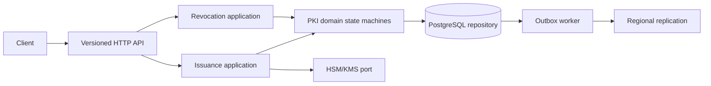

# Multi-region PKI control plane

Pure Go service for CA hierarchy, certificate issuance, ACME-compatible nonce handling, revocation, OCSP status, CRL generation and multi-region replication metadata. The domain layer is framework and database independent; the repository interface can be backed by PostgreSQL while local development uses an explicitly unsafe in-memory store and development HSM.

## Run

```bash
PKI_DEV_HSM=true go run ./cmd/pki-api
curl http://localhost:8080/healthz
go test ./...
go test -race ./...
```

Production startup must leave `PKI_DEV_HSM` unset and inject a HSM/KMS implementation through the `crypto.Signer` port. Development HSM is intentionally not hardware backed and is rejected for production deployments.

## Architecture



## Lifecycle and controls

CA: `pending -> active -> rotating -> retired -> revoked`.
Certificate: `requested -> pending_approval/approved -> issuing -> issued -> published -> renewing/revoked/expired -> archived`.
All transitions increment a version and emit an audit event. Idempotency keys are tenant-scoped; fingerprints and duplicate keys are rejected by the repository. OCSP status is derived from the certificate state and CRL entries use monotonically supplied numbers.

## API examples

`GET /api/v1/ca`, `POST /api/v1/ca`, `POST /api/v1/certificates`, `GET /api/v1/certificates/{id}`, `POST /api/v1/certificates/{id}/revoke`, `GET /api/v1/ocsp/{serial}`, `GET /api/v1/audit/export`, `GET /healthz`, `GET /readyz`, `GET /acme/directory`, `GET /acme/new-nonce`.

## Operations

Structured JSON logs include request IDs. Readiness is separate from liveness. HSM calls carry context deadlines and a retry/circuit-breaker helper is provided. Regional replication envelopes carry vector clocks and fencing tokens; concurrent updates are quarantined as conflicts. The worker scans renewal windows and pending outbox events and exits on SIGTERM.

SLO target: 99.95% API availability, p95 read latency under 100 ms, p95 issuance admission under 500 ms, revocation propagation under 60 s. Capacity baseline is 100 certificates/s per region with PostgreSQL and object storage snapshots; tune worker and database pools before larger loads.

Threat model covers stolen account keys, replayed ACME nonces, forged challenge callbacks, compromised provider credentials, HSM unavailability and region brain-splits. Never fall back to plaintext private keys. Disaster recovery uses PostgreSQL PITR, retained CRL snapshots, outbox replay and regional fencing. Known limitations: production PostgreSQL adapter and TLS-ALPN network validator are explicit integration points and return no false success.
